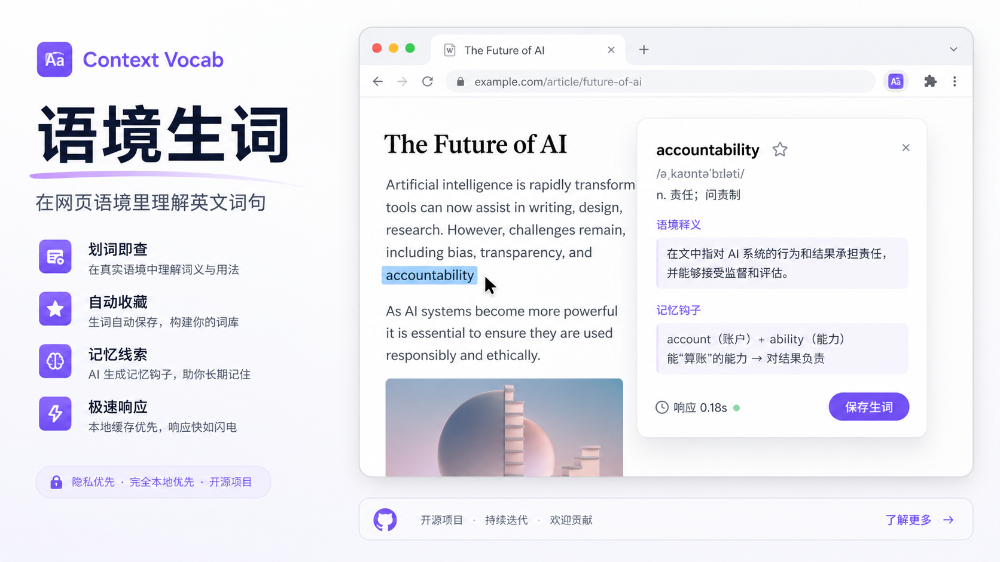
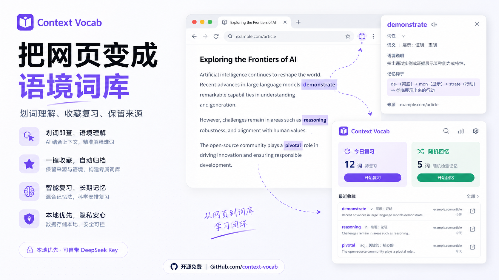
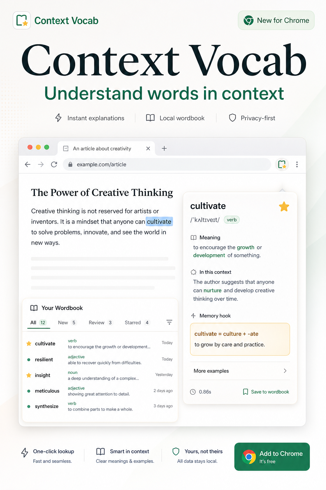
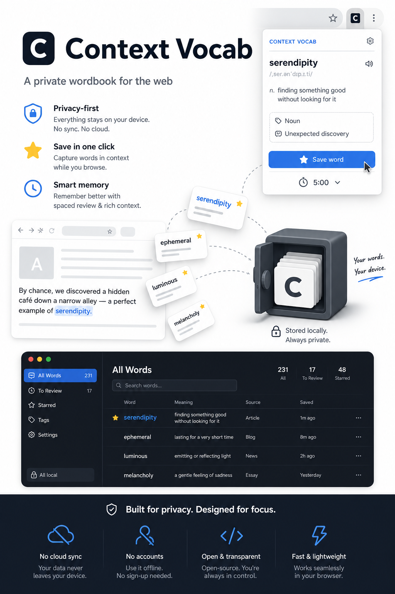
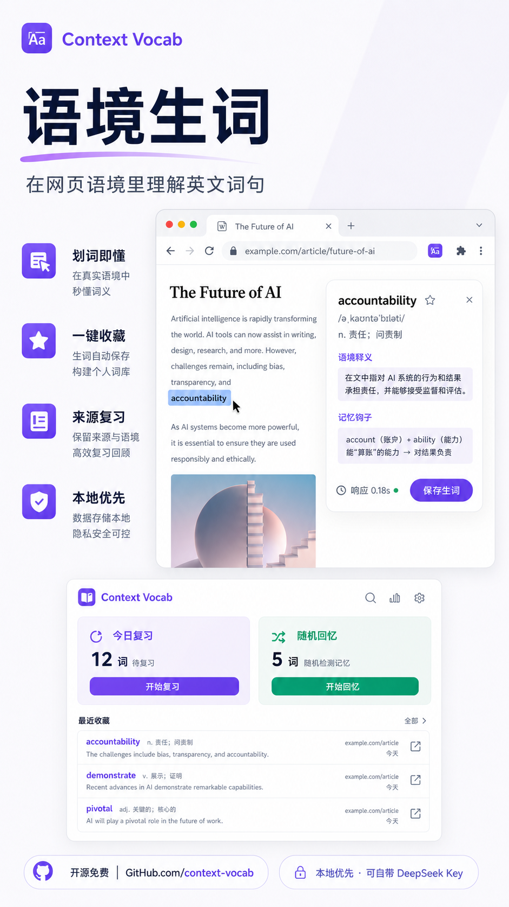
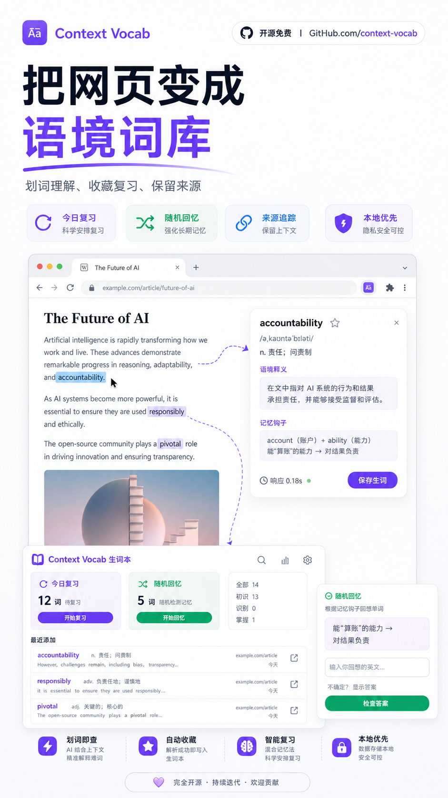

# Context Vocab

<p align="right">
  <a href="./README.md">中文</a> | <strong>English</strong>
</p>



Context Vocab is a local-first Chrome extension for learning English words in context. It turns a text selection into a compact learning loop: understand the selected term inside its sentence, save it to a local wordbook, revisit the original source, and see how long each AI explanation takes.

## Features

- **Context-aware explanations**: Select an English word or phrase and get dictionary meaning, meaning in context, confusing boundary, and a memory hook.
- **Compact floating card**: The card follows the selected text, shows save state, loading state, elapsed time, and only the useful explanation details.
- **Instant save and highlight**: Click the star to save and immediately highlight the selected term on the page; unstar to remove it.
- **Passage translation**: Optionally translate a short surrounding passage to understand the full sentence group without sending too much text.
- **Local wordbook**: Browse by date, familiarity, and source. Review today, recall randomly, and un-favorite directly from any word card.
- **Visible performance**: The loading card shows DeepSeek response time, and cached explanations avoid repeated model calls.
- **Privacy-first**: No bundled backend. API keys and wordbook data stay in local browser storage.

## Installation

```bash
npm install
npm run build
```

Then open `chrome://extensions` in Chrome:

1. Enable Developer mode.
2. Click Load unpacked.
3. Select the generated `dist/` folder.
4. Open the extension Options page and enter your own DeepSeek API key.

Default settings:

- DeepSeek endpoint: `https://api.deepseek.com/chat/completions`
- Model: `deepseek-v4-flash`
- Auto-save: off
- Cached explanations: on
- Passage translation: off

## Privacy And Security

Context Vocab does not include any API key and does not sync user data to a project-owned server.

- API keys are stored in `chrome.storage.local`.
- Wordbook entries, familiarity labels, source records, and cached explanations are stored in `chrome.storage.local`.
- By default, only the selected term and current sentence are sent to the configured DeepSeek endpoint.
- When passage translation is enabled, a short surrounding passage is also sent; long text is clipped before the request.
- The public repository excludes `node_modules/`, `dist/`, `.env*`, `.superpowers/`, and other local-only files.

Before publishing, test placeholder keys were renamed to non-secret values. If you fork this project, do not commit your own API key, browsing data, or real wordbook export.

## Development

```bash
npm test
npm run typecheck
npm run build
```

Project layout:

- `src/content/`: text selection, floating card, instant highlight.
- `src/background/`: DeepSeek requests, cache, save flow.
- `src/popup/`: browser toolbar popup.
- `src/options/`: API and card display settings.
- `src/wordbook/`: wordbook, review, source browsing.
- `tests/`: Vitest unit tests.

## Poster Candidates

These images are AI-generated promotional concepts for the public README and project launch. UI text and data are illustrative.

| Chinese main visual | Chinese wordbook visual |
| --- | --- |
|  |  |

| English UI concept | English privacy concept |
| --- | --- |
|  |  |

| Vertical main visual | Vertical wordbook visual |
| --- | --- |
|  |  |

Extension icons live in `assets/icons/`, and the manifest uses the 16, 32, 48, and 128 pixel versions.

## Status

This is an early but usable Chrome Extension MVP for local installation, testing, and further development. It is not published to the Chrome Web Store yet, and it does not include cloud sync, PDF support, or a full spaced-repetition engine.

## License

MIT
